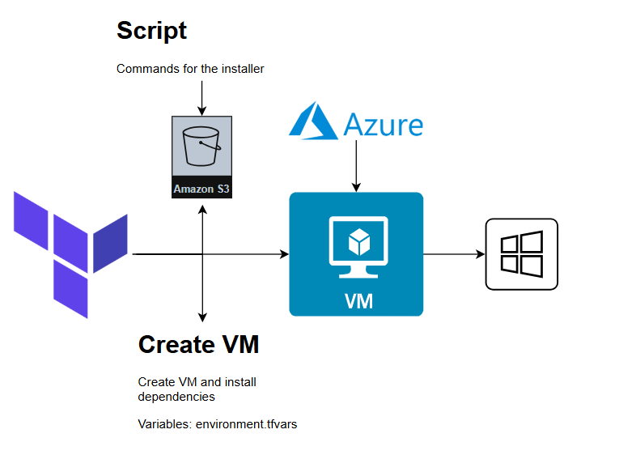

# Create vm with Terraform
This repository offers a Terraform script for deploying virtual machines in Azure, enabling automated and efficient cloud infrastructure management. Perfect for setting up scalable and reproducible environments.

### Diagram


### Requirenments
- Azure account
- Create qa.tfvars file
- Define variables in qa.tfvars

## Steps
1. Azure Login
```
az login
```
2. Selection of subscription
3. Terraform init and terraform workspace
```
terraform init
terraform workspace select qa
```

4. Terraform plan
```
terraform plan -var-file qa.tfvars
```

5. Terraform apply
```
terraform apply -var-file qa.tfvars
```
